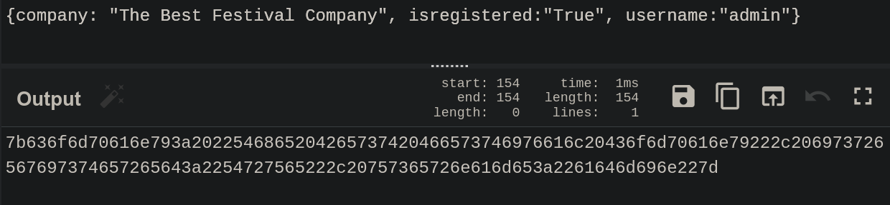
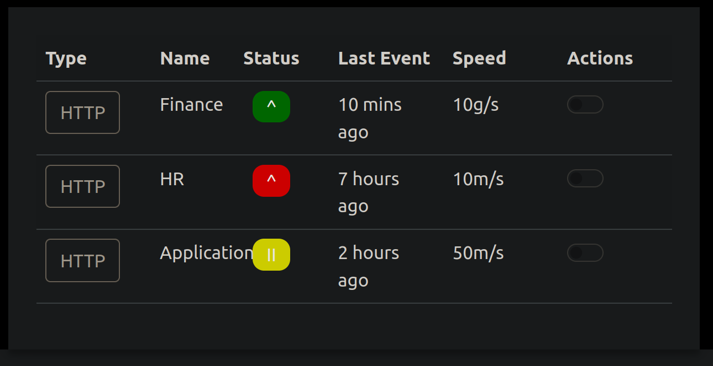
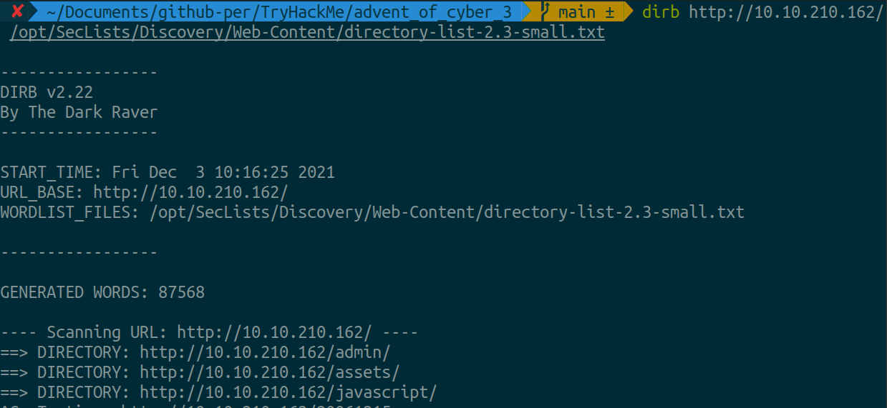
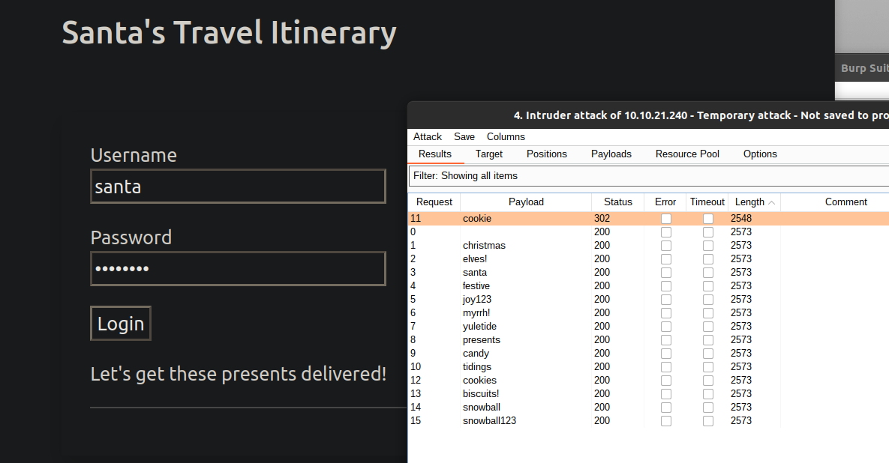
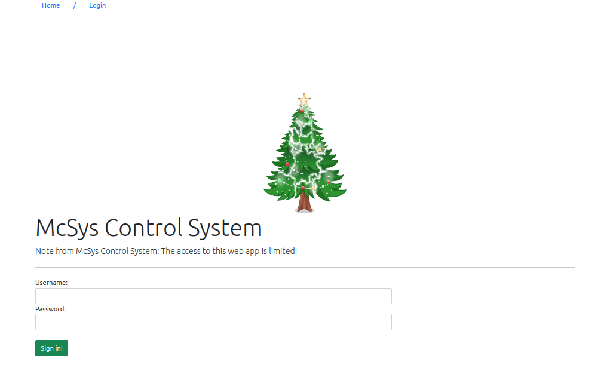
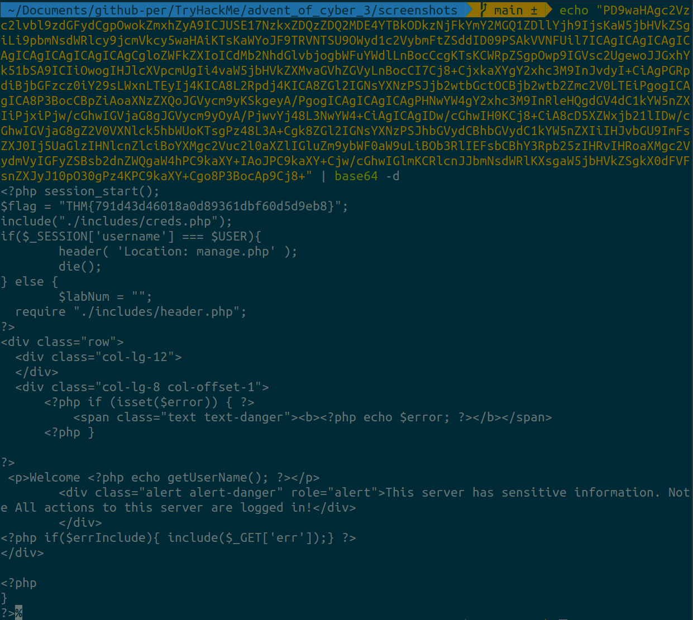
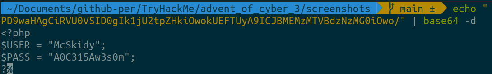

# Advent of Cyber 3 (2021)

> Dec. 1, 2021

## [Day 1] Web Exploitation Save The Gifts 

1. After finding Santa's account, what is their position in the company?

Change the query component value for id to 1. 

`Answer: The Boss!`

2. After finding McStocker's account, what is their position in the company?

Change the query component value for id to 3. 

`Answer: Build Manager`

3. After finding the account responsible for tampering, what is their position in the company?

Change the query component value for id to 9. The data shows multiple inventory sku changes.

`Answer: Mischief Manager`

4. What is the received flag when McSkidy fixes the Inventory Management System?

Navigate to id 9, and revert all inventory.

`Answer: THM{AOC_IDOR_2B34BHI3}`

---

## [Day 2] Web Exploitation Elf HR Problems 

Open the static site in a new tab.

Register an account, and verify the cookies using the Developer Tools in your browser.

1. What is the name of the new cookie that was created for your account?

Press F12, click "Sign Up" and provide dummy information. Click your cookies under storage.

`Answer: user-auth `

2. What encoding type was used for the cookie value?

Cyberchef is a great tool for encoding/decoding values. If you could not determine by eye, you can use the "magic" feature in cyberchef. 

`Answer: hexadecimal`

3. What object format is the data of the cookie stored in?

After decoding the cookie value, the object format is json. 

`Answer: json`

Manipulate the cookie and bypass the login portal.

4. What is the value of the administrator cookie? (username = admin)

In cyberchef, copy the decoded value from our cookie. Edit the username value to admin. Convert back to hex.

`Answer: 7b636f6d70616e793a2022546865204265737420466573746976616c20436f6d70616e79222c206973726567697374657265643a2254727565222c20757365726e616d653a2261646d696e227d`

5. What team environment is not responding?
        
`Answer: HR`

6. What team environment has a network warning?

`Answer: Application`

---

## [Day 3] Web Exploitation Christmas Blackout 

1. Using a common wordlist for discovering content, enumerate hxxp://10.10.210.162/ to find the location of the administrator dashboard. What is the name of the folder? 

Enumerating the domain can be done using the Seclist. 
https://github.com/danielmiessler/SecLists 

`$ dirb hxxp://10.10.210.162/ /opt/SecLists/Discovery/Web-Content/directory-list-2.3-small.txt`

`Answer: admin`

2. In your web browser, try some default credentials on the newly discovered login form for the "administrator" user. What is the password?

Simple guessing of common passwords.

`Answer: administrator`

3. Access the admin panel. What is the value of the flag?

`Answer: THM{ADM1N_AC3SS}`

---

## [Day 4] Web Exploitation Santa's Running Behind

1. What valid password can you use to access the "santa" account?

In burpsuite we will turn intercept on, navigate to the target IP, put in our credentials user: `santa` password:`test` and before clicking login, turn our FoxyProxy on in our browser. After that, we can click login and navigate back to burpsuite. Once in burpsuite we can right-click the intercepted data and send it to intruder, clear all for positions, add the password parameter as the only position, set the attack type to sniper, and navigate to payloads. Download the provided payload and load the document. Start the attack! :)

`Answer: cookie`

2. What is the flag in Santa's itinerary?

Applying our newly found password `cookie,` we can login. 

`Answer: THM{SANTA_DELIVERS}`

---

## [Day 5] Web Exploitation Pesky Elf Forum 

1. What flag did you get when you disabled the plugin?

Guided walkthrough of XSS. 

`Answer: THM{NO_MORE_BUTTMAS}`

---

## [Day 6] Web Exploitation Patch Management Is Hard

**What is the risk of LFI?**

Once you find an LFI vulnerability, it is possible to read sensitive data if you have readable permissions on files. Thus, one of the most significant risks is leaking sensitive data accessed by a regular user. Also, in some cases, an LFI vulnerability could be chained to perform Remote Code Execution RCE on the server. If we can inject or write to a file on the system, we take advantage of LFI to get RCE. In this task, we prepared a web application with an LFI vulnerability and a possible way to get RCE. We'll be looking at this web application later.

1. Deploy the attached VM and look around. What is the entry point for our web application? 

hxxp://10.10.132.188/index.php?err=/etc/passwd

`Answer: err`

2. Use the entry point to perform LFI to read the /etc/flag file. What is the flag?

hxxp://10.10.132.188/index.php?err=/etc/flag

`Answer: THM{d29e08941cf7fe41df55f1a7da6c4c06} `

3. Use the PHP filter technique to read the source code of the index.php. What is the $flag variable's value?

hxxp://10.10.132.188/index.php?err=php://filter/convert.base64-encode/resource=index.php

`Answer: THM{791d43d46018a0d89361dbf60d5d9eb8}`

4. *McSkidy forgot his login credential. Can you help him to login in order to recover one of the server's passwords?* Now that you read the index.php, there is a login credential PHP file's path. Use the PHP filter technique to read its content. What are the username and password?

hxxp://10.10.132.188/index.php?err=php://filter/convert.base64-encode/resource=./includes/creds.php

`Answer: McSkidy:A0C315Aw3s0m`

5. Use the credentials to login into the web application. Help McSkidy to recover the server's password. What is the password of the flag.thm.aoc server? 

Navigate to Password Recovery tab.

`Answer: THM{552f313b52e3c3dbf5257d8c6db7f6f1}`

6. The web application logs all users' requests, and only authorized users can read the log file. Use the LFI to gain RCE via the log file page. What is the hostname of the webserver? The log file location is at ./includes/logs/app_access.log.

**LFI to RCE via Log files**

It is also called a log poisoning attack. It is a technique used to gain remote command execution on the webserver. The attacker needs to include a malicious payload into services log files such as Apache, SSH, etc. Then, the LFI vulnerability is used to request the page that includes the malicious payload. Exploiting this kind of attack depends on various factors, including the design of the web application and server configurations. Thus, it requires enumerations, analysis, and an understanding of how the web application works. For example, a user can include a malicious payload into an apache log file via User-Agent or other HTTP headers. In SSH, the user can inject a malicious payload in the username section. 

The User-Agent is one of the HTTP headers that the user can control. Therefore, in order to get the RCE, you need to include PHP code into User-Agent and send a request to the log file using the LFI to execute in the browser. 

Test:
`curl -A "This is testing" http://10.10.132.188/login.php`

Code Execution can be done sending a php payload. 

`Answer: lfi-aoc-awesome-59aedca683fff9261263bb084880c965`

7. **Bonus:** The current PHP configuration stores the PHP session files in /tmp. Use the LFI to call the PHP session file to get your PHP code executed. 

---

## [Day 7] Web Exploitation Migration Without Security

1. Interact with the MongoDB server to find the flag. What is the flag? 

2. We discussed how to bypass login pages as an admin. Can you log into the application that Grinch Enterprise controls as admin and retrieve the flag? Use the knowledge given in AoC3 day 4 to setup and run Burp Suite proxy to intercept the HTTP request for the login page. Then modify the POST parameter.

3. Once you are logged in, use the gift search page to list all usernames that have guest roles. What is the flag?

4. Use the gift search page to perform NoSQL injection and retrieve the mcskidy record. What is the details record?

---