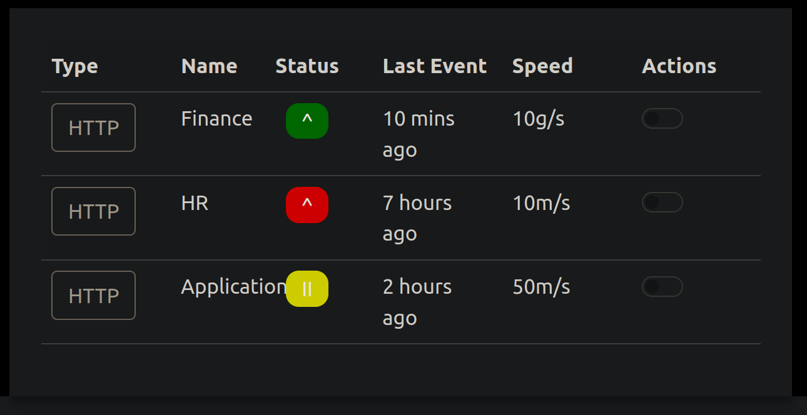

# Advent of Cyber 3 (2021)

> Dec. 2, 2021

## [Day 2] Web Exploitation Elf HR Problems 

Open the static site in a new tab.

Register an account, and verify the cookies using the Developer Tools in your browser.

1. What is the name of the new cookie that was created for your account?

Press F12, click "Sign Up" and provide dummy information. Click your cookies under storage.

`Answer: user-auth `

2. What encoding type was used for the cookie value?

Cyberchef is a great tool for encoding/decoding values. If you could not determine by eye, you can use the "magic" feature in cyberchef. 

`Answer: hexadecimal`

3. What object format is the data of the cookie stored in?

After decoding the cookie value, the object format is json. 

`Answer: json`

Manipulate the cookie and bypass the login portal.

4. What is the value of the administrator cookie? (username = admin)

In cyberchef, copy the decoded value from our cookie. Edit the username value to admin. Convert back to hex.

`Answer: 7b636f6d70616e793a2022546865204265737420466573746976616c20436f6d70616e79222c206973726567697374657265643a2254727565222c20757365726e616d653a2261646d696e227d`

5. What team environment is not responding?
        
`Answer: HR`

6. What team environment has a network warning?

`Answer: Application`
