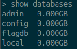
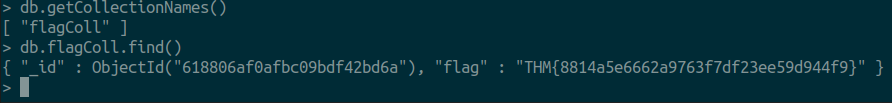

# Advent of Cyber 3 (2021)

> Dec. 7, 2021

## [Day 7] Web Exploitation Migration Without Security

1. Interact with the MongoDB server to find the flag. What is the flag? 

First start by sshing into the machine and use the provided password.

`> ssh thm@10.10.88.197 -p 2222`

Once inside the machine we will type the command `mongo` to connect to the Mongo Database.

To view all the databases inside the MongoDB, we will use the following command.

`> show databases`

This will return a list of databases.

We can now navigate into the flagdb and view its contents.

`> use flagdb`

`> db.getCollectionNames()`

This returns a collection named `flagColl`. We then can view the contents inside.

`Answer: THM{8814a5e6662a9763f7df23ee59d944f9}`

2. We discussed how to bypass login pages as an admin. Can you log into the application that Grinch Enterprise controls as admin and retrieve the flag? Use the knowledge given in AoC3 day 4 to setup and run Burp Suite proxy to intercept the HTTP request for the login page. Then modify the POST parameter.

Using burpsuite, we can intercept the login parameters and modify the post parameters. Changing the password field to `password[$ne]=admin` will allow the backend php to find if the password does not equal admin. This allows us to login as admin and read the flag.

`Answer: THM{b6b304f5d5834a4d089b570840b467a8}`

3. Once you are logged in, use the gift search page to list all usernames that have guest roles. What is the flag?

Just as above, we can send a search request from the website and intercept with burpsuite. Once intercepted we can change the search value to be `[$ne]` and change the role to be guest.

`Answer: THM{2ec099f2d602cc4968c5267970be1326}`

4. Use the gift search page to perform NoSQL injection and retrieve the mcskidy record. What is the details record?

Searching for the name mcskidy we can once again send to intercept. We can see it found no username with the role user. We can modify to look for a role that does not equal user.

`Answer: ID:6184f516ef6da50433f100f4:mcskidy:admin`