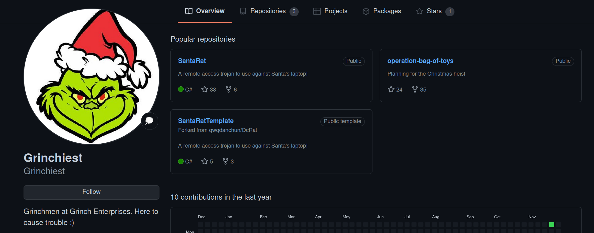

# Advent of Cyber 3 (2021)

> Dec. 8, 2021

## [Day 8] Special by John Hammond Santa's Bag of Toys

1. What operating system is Santa's laptop running ("OS Name")?

Found in the oldest powershell_transcript.

`Answer: Microsoft Windows 11 Pro`

2. Review each transcription log to get an idea for what activity was performed on the laptop just after it went missing. In the "second" transcription log, it seems as if the perpetrator created a backdoor user account! What was the password set for the new "backdoor" account?

The 2nd transcript log shows, net user s4nta grinchstolechristmas /add

`Answer: grinchstolechristmas`

3. In one of the transcription logs,  the bad actor interacts with the target under the new backdoor user account, and copies a unique file to the Desktop. Before it is copied to the Desktop, what is the full path of the original file? 

Transcript 3, shows a copy from the location:

`Answer: C:\Users\santa\AppData\Local\Microsoft\Windows\UsrClass.dat`

4. The actor uses a Living Off The Land binary (LOLbin) to encode this file, and then verifies it succeeded by viewing the output file. What is the name of this LOLbin?

`Answer: certutil.exe`

5. Drill down into the folders and see if you can find anything that might indicate how we could better track down what this SantaRat really is. What specific folder name clues us in that this might be publicly accessible software hosted on a code-sharing platform?

Inside of ShellBags, we can drill down into SantaRat/SantaRat-main and there is a .github dir.

`Answer: .github`

6. Additionally, there is a unique folder named "Bag of Toys" on the Desktop! This must be where Santa prepares his collection of toys, and this is certainly sensitive data that the actor could have compromised. What is the name of the file found in this folder? 

Located inside bag of toys in shellbags.

`Answer: bag_of_toys.zip`

7. What is the name of the user that owns the SantaRat repository?

`Answer: Grinchiest`

8. Explore the other repositories that this user owns. What is the name of the repository that seems especially pertinent to our investigation?

`Answer: operation-bag-of-toys`

9. Read the information presented in this repository. It seems as if the actor has, in fact, compromised and tampered with Santa's bag of toys! You can review the activity in the transcription logs. It looks as if the actor installed a special utility to collect and eventually exfiltrate the bag of toys. What is the name of the executable that installed a unique utility the actor used to collect the bag of toys?

Found in the 4th transcript file.

`Answer: uharc-cmd-install.exe`

10. Following this, the actor looks to have removed everything from the bag of toys, and added in new things like coal, mold, worms, and more!  What are the contents of these "malicious" files (coal, mold, and all the others)?

echo command inside of the 4th trasncript file.

`Answer: GRINCHMAS`

11. What is the password to the original bag_of_toys.uha archive? (You do not need to perform any password-cracking or bruteforce attempts)

In the commit message `stole Santa's bag of toys!!!!!!!!!!!!!!` 

`Answer: TheGrinchiestGrinchmasOfAll`

12. How many original files were present in Santa's Bag of Toys?

Uncompressing the bag_of_toys using the new password we found, we can determine there is 228 items!

`Answer: 228`
