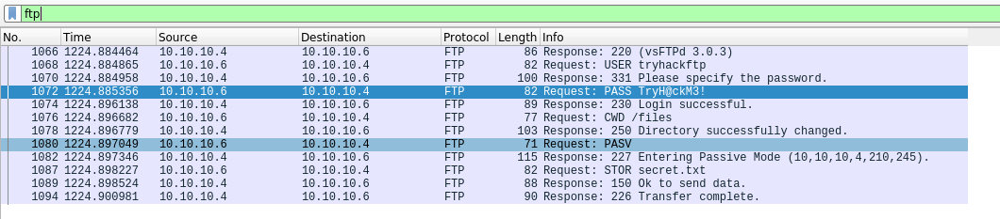

# Advent of Cyber 3 (2021)

> Dec. 9, 2021

## [Day 9] Networking Where Is All This Data Going 

"In this task, we will walk you through the required skills and knowledge to perform a basic packet analysis using Wireshark."

Start by loading the pcap file into Wireshark.

`> sudo wireshark /root/Rooms/AoC3/Day9/AoC3.pcap`

1. In the HTTP #1 - GET requests section, which directory is found on the web server?

`Answer: login`

2. What is the username and password used in the login page in the HTTP #2 - POST section? 

`Answer: McSkidy:Christmas2021`

3. What is the User-Agent's name that has been sent in HTTP #2 - POST section?

Shown in previous screenshot.

`Answer: TryHackMe-UserAgent-THM{d8ab1be969825f2c5c937aec23d55bc9}`

4. In the DNS section, there is a TXT DNS query. What is the flag in the message of that DNS query?

Filtering on `dns` we can view the query.

`Answer: THM{dd63a80bf9fdd21aabbf70af7438c257}`

5. In the FTP section, what is the FTP login password?

Filtering on `ftp` we can view the value.

`Answer: TryH@ckM3!`

6. In the FTP section, what is the FTP command used to upload the secret.txt  file?

Shown in previous screenshot.

`Answer: STOR`

7. In the FTP section, what is the content of the secret.txt file?

`Answer: 123^-^321`
